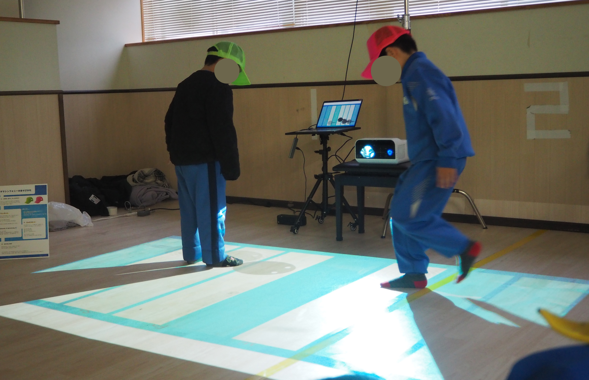
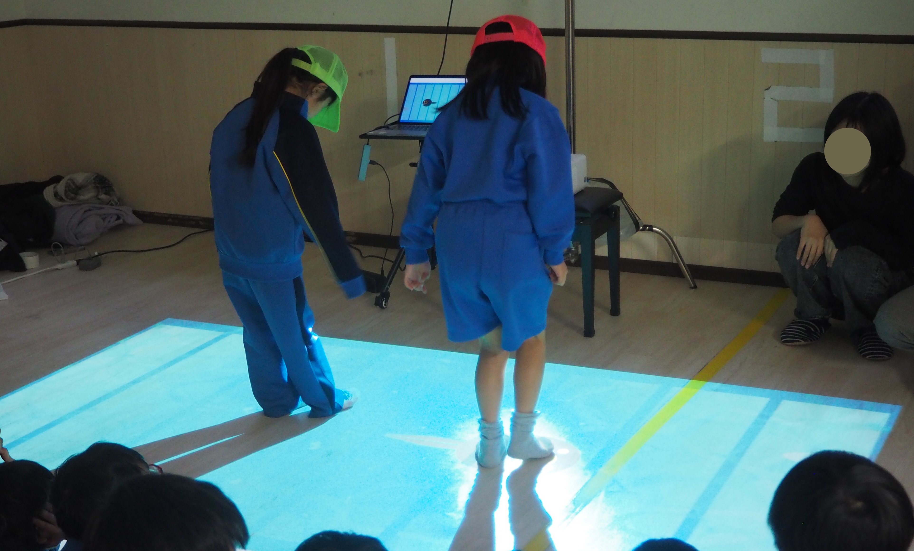
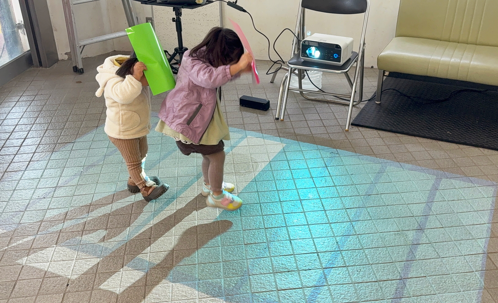

# Otama Symphony

これは私の卒業制作物の一環です。
歩く・しゃがむなどの身体の動きによって、音と映像がリアルタイムに変化する体験型インスタレーション作品です。

子どもから大人まで、年齢や得意不得意に関係なく関われることを大切にし、
「遊び方を教える」のではなく、「遊びが自然に生まれる場」をつくることを目指しています。

---

## 🎥 Demo

[]
[]
[]
[]

※人物が映る素材については、プライバシーに配慮して加工しています。

---

## 🛠 Tech
- Python 3.11
- OpenCV
- NumPy
- pygame
- Projector + Camera

---

## 📌 Status
卒業制作として制作・改良中です。
